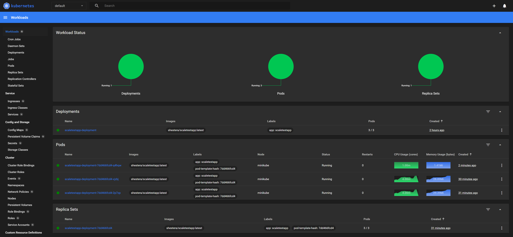
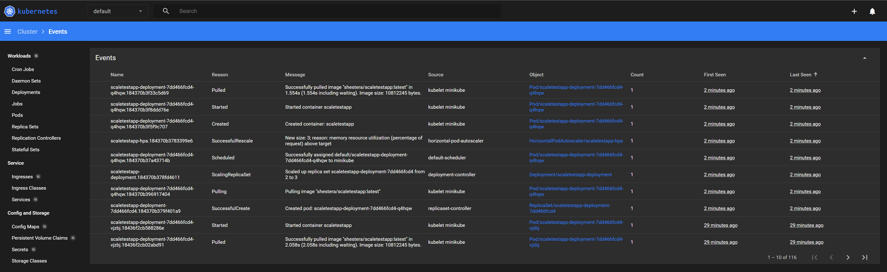
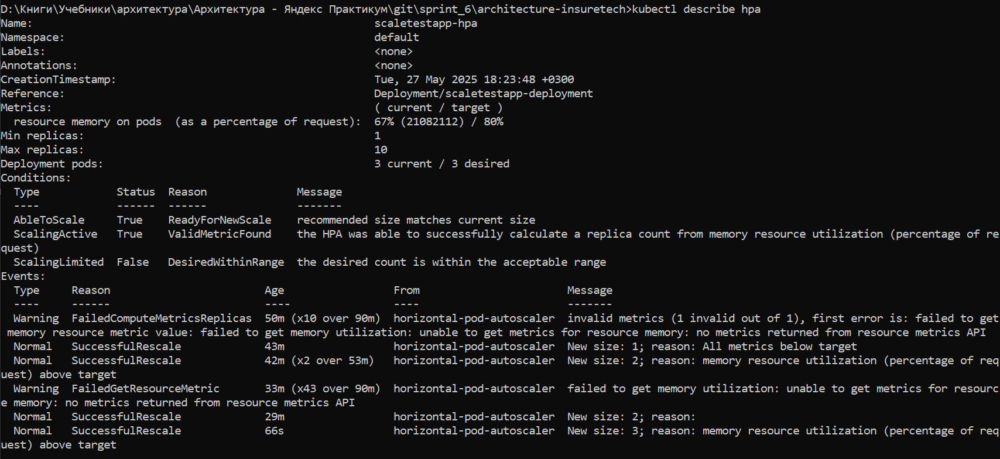
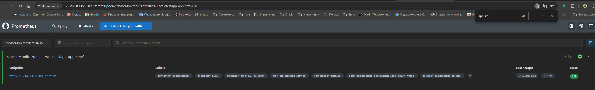
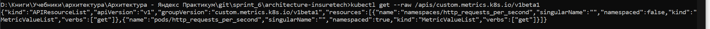
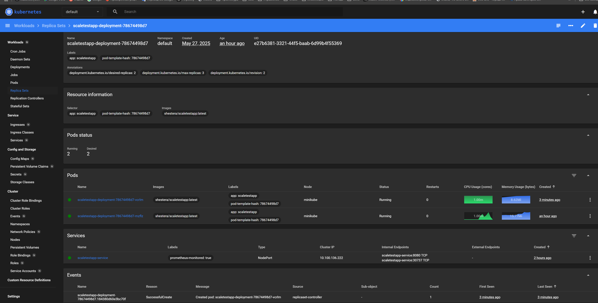
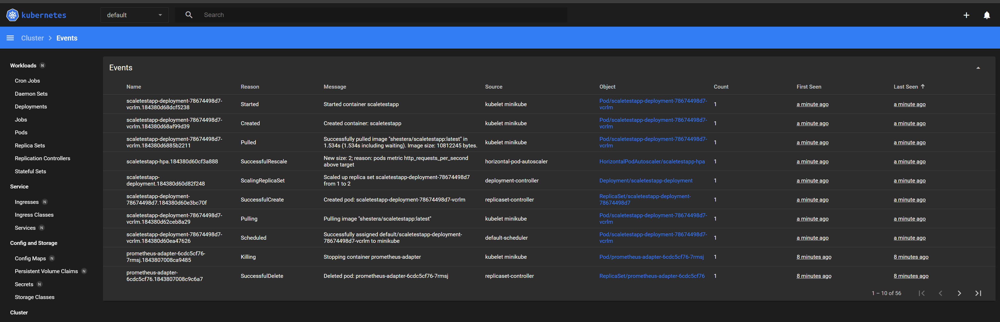
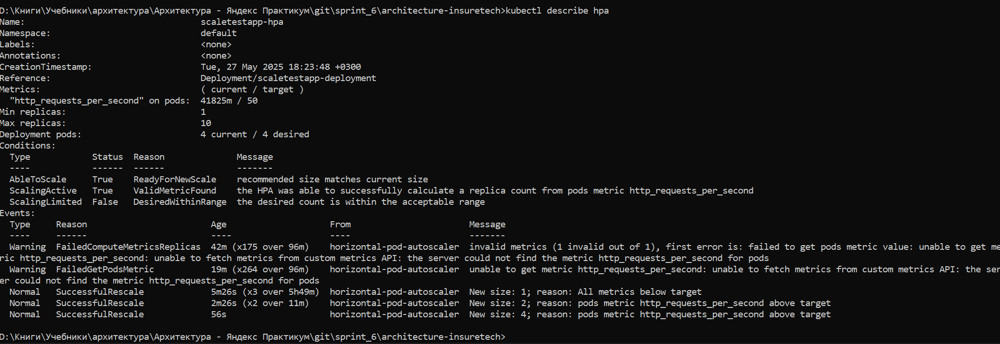

# architecture-insuretech
## task 1

[Новая технологическая архитектура](Task1/InsureTech_технологическая_архитектура_to-be.drawio)


## task 2
### 2.1.1 Поднять локальный кластер Kubernetes в Minikube
```shell
minikube start
```
### 2.1.2 Активировать metrics-server
```shell
minikube addons enable metrics-server
```
### 2.1.3 Написать манифест развёртывания (Deployment) и примените в кластере. Лимит памяти установить равный “30Mi”
```shell
kubectl apply -f ./task2/scaletestapp-deployment.yaml
```
### 2.1.4 Написать и применить манифест сервиса (Service) для доступа к приложению
```shell
kubectl apply -f ./task2/scaletestapp-service.yaml
```
### 2.1.5 Настроить динамическую маршрутизацию на основании показателей утилизации оперативной памяти с помощью Horizontal Pod Autoscaler
```shell
kubectl apply -f ./task2/scaletestapp-hpa.yaml
```
### 2.1.6 Открыть доступ к приложению из внешнего мира

```shell
minikube service scaletestapp-service --url
```
### 2.1.7 Запустить Locust
```shell
locust -f ./task2/locustfile.py
```
### 2.1.8 Настроить параметры нагрузочного тестирования в Web UI и запустить.
Видно, что кол-вод подов увеличилось с 1 до 3 постепенно с ростом утилизированной памяти.

[Дашборд миникуба](Task2/scaling_dashboard.jpg)


[События миникуба](Task2/scaling_log.jpg)


[Лог HPA](Task2/scaling_describe_hpa.jpg)


## task2. Дополнительная часть
### 2.2.1 Установить Prometheus в кластере
```shell
helm repo add prometheus-community <https://prometheus-community.github.io/helm-charts>
helm repo update
helm install prometheus-operator prometheus-community/kube-prometheus-stack -f ./Task2/additional/custom_values.yaml
```
### 2.2.2 Применить манифест ServiceMonitor для экспорта метрик из приложения в Prometheus
```shell
kubectl apply -f ./task2/additional/scaletestapp-servicemonitor.yaml
```
### 2.2.3 Открыть доступ к Prometheus из внешнего мира
```shell
minikube service prometheus-operator-kube-p-prometheus --url
```
### 2.2.4 Проверить получение метрик scaletestapp через ServiceMonitor. В таргетах д.б. соответствующий элемент
[Scaletestapp Target в Prometheus](Task2/additional/scaletestapp-app-sm-target.jpg)

### 2.2.5 Настроить Prometheus Adapter для использования метрик Prometheus в Horizontal Pod Autoscaler
```shell
helm install prometheus-adapter prometheus-community/prometheus-adapter -f ./Task2/additional/custom_metrics.yaml
```
### 2.2.6 Проверить что кастомная метрика добавилась
```shell
get --raw /apis/custom.metrics.k8s.io/v1beta1
```


### 2.2.7 Обновить манифест Horizontal Pod Autoscaler с использованием новой метрики

[Новая версия манифеста HPA](Task2/additional/scaletestapp-hpa-new.yaml)
Применим её
```shell
kubectl apply -f ./task2/additional/scaletestapp-hpa-new.yaml
```
### 2.2.8 Запустить Locust
```shell
locust -f ./task2/locustfile.py
```
### 2.2.9 Настроить параметры нагрузочного тестирования в Web UI и запустить.
Сначала дал rps 100+, затем 200+. Каждый раз поды отскейлились х2

[Дашборд миникуба](Task2/additional/scaling_dashboard.jpg)


[События миникуба](Task2/additional/scaling_log.jpg)


[Лог HPA](Task2/additional/scaling_describe_hpa.jpg)

## Вводные данные по проблемам архитектуры
### Известные проблемы 
#### Сайт медленно загружает страницы
Когда нагрузка на приложение повышается, пользователи массово жалуются на то, что страницы грузятся по несколько минут или не загружаются вообще. В это время нагрузка на запросы поиска составила 50 RPS, а на запросы оформления — 10 RPS
#### Нарушается SLA для B2B-клиентов
В это время нагрузка от одного партнера достигала 250 RPS.
#### Приложение падает
Команда реагировала на проблему очень медленно, поскольку узнавала о ней от пользователей. 
## task 3. Переход на Event-Driven архитектуру
### 3.1 Потенциальные проблемы текущей архитектуры при росте нагрузки/клиентской базы:
#### 3.1.1 Все интеграции на синхронном взаимодействии
В частности ключевые сервисы core-app, ins-comp-settlement, ins-product-aggregator и внешние API страховых компаний и платежный сервис.

Как следствие, вся система зависит от надежности и производительности любого её компонента, до которого доходит цепочка клиентских вызовов. При увеличение нагрузки надежность будет снижаться, а масштабирование одного компонента будет требовать масштабирования остальных.
#### 3.1.2 Синхронное взаимодействие core-app, ins-comp-settlement с ins-product-aggregator по тарифам
Обновление тарифных планов и списка продуктов - очень редкое событие, но ради его своевременного получения делаются 15 минутные запросы core-app - ins-product-aggregator. А ночной запрос ins-comp-settlement - ins-product-aggregator может попасть на ночные работы у партнеров и это заблокирует формирование всего реестра за день.
#### 3.1.3 Синхронное взаимодействие ins-product-aggregator с API страховых компаний по тарифам
Единый вызов с агрегацией API всех страховых компаний чреват увеличением времени отклика, а также снижением общей надежности, т.к. отказ одного из партнеров = отказу запроса по всем партнерам. При дальнейшем росте числа партнеров, вероятность и количество таких отказов будет расти (у партнеров сбои, работы и в целом они не оглядываются на наши SLA), а повторные запросы могут еще больше усугублять проблемы, т.к. партнеры могут ограничивать число запросов к ним
#### 3.1.4 Синхронное взаимодействие ins-comp-settlement с core-app и API страховых компаний для взаиморасчетов по оформленным полисам
Количество оформленных за день страховок значительное вырастет, что может привести к нехватке времени на получение и передачу всех полисов и связанных с ними платежно-учетными реестрами способом синхронного взаимодействия в течение отведенных временных окон. Также значительно увеличатся накладные ресурсы на передачу по сути потоковой информации, вырастет зависимость от качества сети и при пересечении таких "отгрузок" с высокой активностью клиентов будут чаще возникать сбои.
### 3.2 Предложения по оптимизации переходом на Event-Streaming и использованием tranaction outbox
#### 3.2.1 Взаимодействие core-app, ins-comp-settlement с ins-product-aggregator по тарифам
Перевести с синхронного взаимодействия на асинхронную модель "публикация-подписка", в которой ins-product-aggregator будет публиковать событие, что обновился конкретный справочник доступных продуктов или тарифов. Если размер справочника позволяет (< 500 Мб), то он может быть вложен в событие, либо оставить текущий способ получения через вложенный синхронный вызов, т.к. событие редкое + обновление справочников через ручку может потребоваться, например, при работах. В будущем, если размер справочника станет неприлично большим, можно будет передавать его в виде ссылки на файл в S3.
#### 3.2.2 Взаимодействие ins-product-aggregator с API страховых компаний по тарифам
Переход на асинхронное взаимодействие между внутренними сервисами по тарифам позволит сервису ins-product-aggregator обращаться к внешним API страховых компаний за тарифами не единым бандлом ко всем сразу, как сейчас, а в соответствии с индивидуальным расписанием/частотой исходя из важности/величины партнера. Кроме того, не любое изменения справочника партнера может привести к изменению итогового справочника для внутренних сервисов (неактуальные для нас продукты, дубли продуктов и т.д.).
#### 3.2.3 Взаимодействие ins-comp-settlement с core-app
Перевести синхронное взаимодействие сервиса ins-comp-settlement с core-app по получению оформленных страховок, на асинхронное "публикация-подписка", когда core-app сразу публикует в очередь события оформления полиса со всей необходимой информацией по нему, а ins-comp-settlement в течение дня получает их по подписке, обрабатывает и сохраняет результат локально у себя.

**Используем паттерн Transactional Outbox** для согласования фиксации оформления полиса в БД Core-db и отправки события в исходящую очередь через запись в Outbox-таблице
#### 3.2.4 Взаимодействие ins-comp-settlement и API страховых компаний для взаиморасчетов
Перевести прямое синхронное взаимодействие сервиса ins-comp-settlement с API страховых компаний для передачи реестров по взаиморасчетам на отправку через очередь, в которую сервис публикует подготовленный реестр, а отдельный сервис будет заниматься перекладыванием этих реестров из очереди в API конкретной страховой компании.

Это позволит отделить логику взаиморасчетов и формирования реестров от логики транспорта реестра и не зависеть расчетному сервису от доступности внешнего API.
### 3.3 Обновленная диаграмма контейнеров C4 с переходом на Event-Driven архитектуру
[Диаграмма контейнеров C4 с переходом на Event-Driven архитектуру](Task3/InsureTech_C4_сontainer-diagram-tobe.jpg)

## task 4. Проектирование продажи ОСАГО
Проработайте реализацию osago-aggregator
### 4.1. Хранилище данных
Потребуется своё хранилище:
- для реализации Transactional Outbox для отправки запроса предложений во множество API партнеров
- для отслеживания получения предложений по отправленным запросам. Т.к. сервис может не получить сразу ответ с предложением из-за специфики взаимодействия с партнером, сбоя или тех работ (таймауты), то обращение для получения предложения может повторяться несколько раз, но при этом общее время на получение должно быть не больше настраиваемого интервала (сейчас 60 секунд). Без хранилища при рестарте экземпляров сервисов необходимая для этого информация будет теряться, клиенты не получат предложений и будет расти негатив на продукт
- отдельное хранилище, т.к. это отдельный новый продукт с большим количеством пользователей (2,5 тыс. пользователей одновременно) и лучше на старте сразу убрать взаимовлияние с другими существующими продуктами, а также упростить возможность отдельного масштабирования.
### 4.2 osago-aggregator API для core-app
Тип взаимодействия "точка-точка", т.к. речь про запрос данных.

Т.к. взаимодействие со страховыми по получению предложений асинхронное и довольно продолжительное (до 60 сек., т.е. не в реальном времени), нет необходимости реализовывать синхронное API с core-app. Более того, с учетом долгих запросов, оно скорее негативно повлияет на стабильность и потребует более высокой надежности сети.

В качестве брокера выбор за ActiveMQ или RabbitMQ, т.к. взаимодействие "точка-точка", поток запросов на ОСАГО не крайне высокий (тысячи MessagesInPerSec в пике), а также могут потребоваться возможности повторной отправки и фильтрации по ID заявки.
### 4.3 core-app API для веб-приложения
Клиент отправляет синхронный запрос на получение предложений по ОСАГО и по факту успешного размещения запроса в очереди ins-osago-data-queue получает положительный ответ. В противном случае клиент имеет возможность повторить запрос.

Далее приложение асинхронно получает предложения от страховых и по мере их получения сразу отправляет эти данные клиенту. Это односторонняя отправка сообщений с сервера на фронтенд, а потому выбираем технологию SSE, которая не блокируется корпоративными средствами защиты и достаточна для требуемого функционала
### 4.4 применение паттернов отказоустойчивости
- Timeout — применяем на стороне core-app и ins-osago-offer-aggregator для ограничения времения на публикацию сообщений в очереди, а также на получения ответов от API страховых, чтобы не словить неопределенные блокировки с исчерпанием ресурсов в пулах и по памяти
- Retry — на стороне ins-osago-offer-aggregator для повторной отправки запросов во внешние API партнерских страховых в случае проблем на их стороне и для повторной публикации предложений в очередь сообщений в случае внутренних проблем (сетевая доступность, тех работы)
- Rate Limiting — на стороне core-app для ограничения нагрузки в сторону ins-osago-offer-aggregator от клиентов
- Circuit Breaker — на стороне ins-osago-offer-aggregator для изоляции от внешних API партнерских страховых в случае проблем на их стороне
### 4.5 Обновленная диаграмма контейнеров C4
[Обновленная диаграмма контейнеров C4](Task4/InsureTech_C4_сontainer-diagram-tobe.jpg)

## task 5 Проектирование GraphQL API
[GraphQL client-inf](Task5/client-info.gql)
## task 6 Настройка Rate Limiting
[Конфиг Nginx](Task6/nginx.conf)