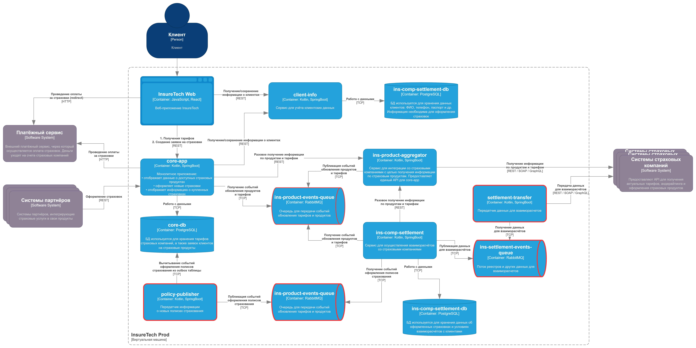

## task 3. Переход на Event-Driven архитектуру
### 3.1 Потенциальные проблемы текущей архитектуры при росте нагрузки/клиентской базы:
#### 3.1.1 Все интеграции на синхронном взаимодействии
В частности ключевые сервисы core-app, ins-comp-settlement, ins-product-aggregator и внешние API страховых компаний и платежный сервис.

Как следствие, вся система зависит от надежности и производительности любого её компонента, до которого доходит цепочка клиентских вызовов. При увеличение нагрузки надежность будет снижаться, а масштабирование одного компонента будет требовать масштабирования остальных.
#### 3.1.2 Синхронное взаимодействие core-app, ins-comp-settlement с ins-product-aggregator по тарифам
Обновление тарифных планов и списка продуктов - очень редкое событие, но ради его своевременного получения делаются 15 минутные запросы core-app - ins-product-aggregator. А ночной запрос ins-comp-settlement - ins-product-aggregator может попасть на ночные работы у партнеров и это заблокирует формирование всего реестра за день.
#### 3.1.3 Синхронное взаимодействие ins-product-aggregator с API страховых компаний по тарифам
Единый вызов с агрегацией API всех страховых компаний чреват увеличением времени отклика, а также снижением общей надежности, т.к. отказ одного из партнеров = отказу запроса по всем партнерам. При дальнейшем росте числа партнеров, вероятность и количество таких отказов будет расти (у партнеров сбои, работы и в целом они не оглядываются на наши SLA), а повторные запросы могут еще больше усугублять проблемы, т.к. партнеры могут ограничивать число запросов к ним
#### 3.1.4 Синхронное взаимодействие ins-comp-settlement с core-app и API страховых компаний для взаиморасчетов по оформленным полисам
Количество оформленных за день страховок значительное вырастет, что может привести к нехватке времени на получение и передачу всех полисов и связанных с ними платежно-учетными реестрами способом синхронного взаимодействия в течение отведенных временных окон. Также значительно увеличатся накладные ресурсы на передачу по сути потоковой информации, вырастет зависимость от качества сети и при пересечении таких "отгрузок" с высокой активностью клиентов будут чаще возникать сбои.
### 3.2 Предложения по оптимизации переходом на Event-Streaming и использованием tranaction outbox
#### 3.2.1 Взаимодействие core-app, ins-comp-settlement с ins-product-aggregator по тарифам
Перевести с синхронного взаимодействия на асинхронную модель "публикация-подписка", в которой ins-product-aggregator будет публиковать событие, что обновился конкретный справочник доступных продуктов или тарифов. Если размер справочника позволяет (< 500 Мб), то он может быть вложен в событие, либо оставить текущий способ получения через вложенный синхронный вызов, т.к. событие редкое + обновление справочников через ручку может потребоваться, например, при работах. В будущем, если размер справочника станет неприлично большим, можно будет передавать его в виде ссылки на файл в S3.
#### 3.2.2 Взаимодействие ins-product-aggregator с API страховых компаний по тарифам
Переход на асинхронное взаимодействие между внутренними сервисами по тарифам позволит сервису ins-product-aggregator обращаться к внешним API страховых компаний за тарифами не единым бандлом ко всем сразу, как сейчас, а в соответствии с индивидуальным расписанием/частотой исходя из важности/величины партнера. Кроме того, не любое изменения справочника партнера может привести к изменению итогового справочника для внутренних сервисов (неактуальные для нас продукты, дубли продуктов и т.д.).
#### 3.2.3 Взаимодействие ins-comp-settlement с core-app
Перевести синхронное взаимодействие сервиса ins-comp-settlement с core-app по получению оформленных страховок, на асинхронное "публикация-подписка", когда core-app сразу публикует в очередь события оформления полиса со всей необходимой информацией по нему, а ins-comp-settlement в течение дня получает их по подписке, обрабатывает и сохраняет результат локально у себя.

**Используем паттерн Transactional Outbox** для согласования фиксации оформления полиса в БД Core-db и отправки события в исходящую очередь через запись в Outbox-таблице
#### 3.2.4 Взаимодействие ins-comp-settlement и API страховых компаний для взаиморасчетов
Перевести прямое синхронное взаимодействие сервиса ins-comp-settlement с API страховых компаний для передачи реестров по взаиморасчетам на отправку через очередь, в которую сервис публикует подготовленный реестр, а отдельный сервис будет заниматься перекладыванием этих реестров из очереди в API конкретной страховой компании.

Это позволит отделить логику взаиморасчетов и формирования реестров от логики транспорта реестра и не зависеть расчетному сервису от доступности внешнего API.
### 3.3 Обновленная диаграмма контейнеров C4 с переходом на Event-Driven архитектуру
[Диаграмма контейнеров C4 с переходом на Event-Driven архитектуру](InsureTech_C4_сontainer-diagram-tobe.jpg)
